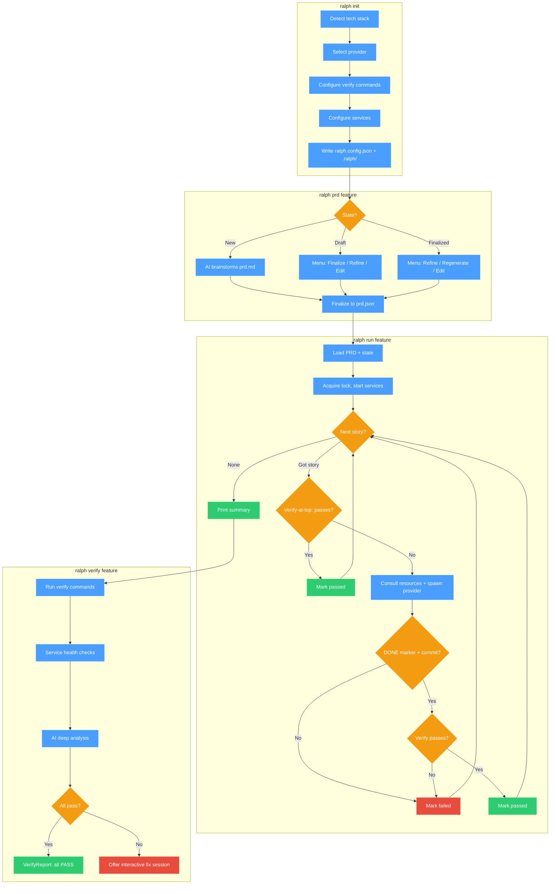
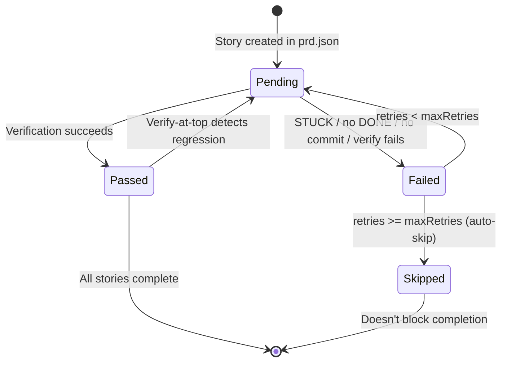

# Ralph

Autonomous AI agent loop that implements entire features from a PRD — with any AI coding CLI.

```bash
# Install
curl -fsSL https://raw.githubusercontent.com/scripness/ralph/main/install.sh | bash
# or: go install github.com/scripness/ralph@latest

# Use
ralph init                # detect project, pick provider, configure verification
ralph prd auth            # brainstorm and finalize a PRD with AI
ralph run auth            # infinite loop until every story passes verification
ralph verify auth         # comprehensive verification with AI deep analysis
```

Ralph orchestrates AI coding agents in a deterministic loop: pick the next story, spawn a fresh AI instance, verify the implementation with your project's own test suite, persist learnings, repeat. The CLI controls everything — story selection, state management, verification, service lifecycle — while the AI provider is a pure code implementer.

---

## Features

### Provider-Agnostic Design

Ralph works with any AI CLI that can read a prompt and write code. Five providers have built-in defaults; anything else works too.

| Provider | Default args | Prompt delivery | Knowledge file |
|----------|-------------|----------------|----------------|
| `amp` | `--dangerously-allow-all` | stdin | AGENTS.md |
| `claude` | `--print --dangerously-skip-permissions` | stdin | CLAUDE.md |
| `opencode` | `run` | arg | AGENTS.md |
| `aider` | `--yes-always` | arg (flag: `--message`) | AGENTS.md |
| `codex` | `exec --full-auto` | arg | AGENTS.md |
| *other* | — | stdin | AGENTS.md |

Only `provider.command` is required in config — everything else is auto-detected from the command name. Set `"args": []` to explicitly opt out of defaults.

Providers communicate with Ralph through three markers detected on stdout/stderr:

| Marker | Meaning |
|--------|---------|
| `<ralph>DONE</ralph>` | Implementation complete, ready for verification |
| `<ralph>STUCK:reason</ralph>` | Cannot proceed — counts as a failed attempt |
| `<ralph>LEARNING:text</ralph>` | Insight saved for future iterations |

Markers are matched as whole lines (not substrings) to prevent spoofing.

### Interactive PRD Workflow

`ralph prd <feature>` drives a state machine that walks you through creating, refining, and finalizing a PRD:

**New feature** — AI brainstorms a `prd.md` draft, then prompts you to finalize it into structured `prd.json`.

**Draft exists** (prd.md, no prd.json):
- Finalize to prd.json
- Refine with AI
- Edit prd.md manually
- Quit

**Finalized** (both files exist):
- Refine with AI — opens an interactive session pre-loaded with the full feature context: PRD content, progress, learnings, git diff, codebase discovery, resource consultation guidance
- Regenerate prd.json — safe because execution state lives in a separate `run-state.json`
- Edit prd.md / Edit prd.json manually
- Quit

If `prd.json` is corrupted or has a wrong schema version, a recovery menu offers to regenerate or edit.

### Deterministic Agent Loop

`ralph run <feature>` enters an infinite loop until every story is passed or skipped:

1. **Readiness gates** — refuses to start if: not in a git repo, `sh` missing, `.ralph/` not writable, verify commands are placeholder, command binaries not in PATH
2. **Load state** — reads `prd.json` + `run-state.json`, acquires lock, creates/switches to `ralph/<feature>` branch, starts services
3. **Pick next story** — highest priority, not passed, not skipped
4. **Verify-at-top** — runs verification *before* spawning the provider. If the story already passes, marks it done and moves on. Skipped on fresh branches (no implementation commits yet) to prevent false positives
5. **Resource consultation** — spawns lightweight subagents to search cached framework source and produce focused guidance
6. **Spawn provider** — sends prompt with story details, learnings, consultation guidance, cross-feature learnings
7. **Detect markers** — scans provider output for DONE, STUCK, LEARNING
8. **Commit check** — provider must have created a new git commit (DONE without a commit = failed attempt)
9. **Verify** — runs typecheck, lint, test commands + service health checks. For `ui`-tagged stories: restarts services, runs e2e tests
10. **Mark result** — pass → next story; fail → retry up to `maxRetries` (default 3), then auto-skip
11. **Repeat** until all stories are passed or skipped

SIGINT/SIGTERM triggers graceful cleanup: kills provider process group, stops services, releases lock, exits 130.

### Multi-Layer Verification

**During `ralph run`** — per-story verification after each implementation: typecheck + lint + unit tests + service health. UI stories also get service restarts and e2e tests.

**`ralph verify <feature>`** — comprehensive standalone verification:
- All verify commands (default + UI)
- Service health checks
- Test file change detection (warns if no test files modified)
- Knowledge file change detection
- AI deep analysis — subagent reads changed files, checks every acceptance criterion, outputs `VERIFY_PASS` or `VERIFY_FAIL:reason`
- Structured `VerifyReport` with PASS/FAIL/WARN items

On failure, offers an interactive AI fix session pre-loaded with the full failure context.

### Framework Source Consultation

Ralph auto-resolves every project dependency to its source repository, caches it locally, and spawns lightweight subagents to search the cached source before each story.

**Resolution flow:**
1. Extract dependencies from package.json / go.mod / pyproject.toml / Cargo.toml / mix.exs
2. Read exact versions from lock files (bun.lock, package-lock.json, yarn.lock v1/berry, pnpm-lock.yaml v6/v9, go.mod)
3. Resolve repo URLs from registries (npm, PyPI, crates.io, hex.pm, Go module paths)
4. Shallow-clone at the version tag to `~/.ralph/resources/name@version/`

**Consultation flow:**
- Before each story, Ralph picks up to 3 relevant frameworks using tag matching (`ui` → React/Vue/Svelte, `db` → Prisma/Drizzle, `api` → Express/Fastify), keyword matching (2+ hits required), and name-based matching
- Spawns parallel subagents that search cached source and return focused guidance (200-800 tokens each)
- Results are cached per story (SHA256 hash) — retries reuse cached consultations
- Falls back to web search instructions when no resources are available

Typical cache sizes: React ~280MB, Next.js ~450MB, smaller libs 10-30MB. Delete `~/.ralph/resources/` to free space.

### Service Management

Ralph manages dev servers across the entire lifecycle:

1. **Start** — spawns service process with process group isolation (`Setpgid`)
2. **Ready check** — polls the `ready` URL every 500ms until HTTP status < 500
3. **Restart** — optionally restarts before each verification (`restartBeforeVerify: true`)
4. **Health check** — verifies services still respond during verification
5. **Cleanup** — kills entire process group on exit, error, or signal

Service output is captured for diagnostics but not printed to the console. At least one service is required.

### Cross-Feature Memory

Learnings accumulate per feature in `run-state.json`. When running a new feature, Ralph automatically collects learnings from other completed features and includes them in the prompt — insights discovered during `auth` (e.g., "use bcrypt for password hashing") are available when implementing `billing`.

- Deduplicated via case-insensitive normalization
- Capped at 50 most recent in prompts
- Read-only aggregation — never copied between features
- Only injected into the implementation prompt, not verify-fix or refine

### Observability

**`ralph logs <feature>`** — view run history and event logs:

```bash
ralph logs auth                     # Latest run, last 50 events
ralph logs auth --list              # List all runs with timestamps and outcomes
ralph logs auth --summary           # Detailed summary of latest run
ralph logs auth --run 2             # View specific run
ralph logs auth --follow            # Tail the log live (like tail -f)
ralph logs auth --tail 100          # Last 100 events
ralph logs auth --type error        # Filter by event type
ralph logs auth --story US-001      # Events for specific story
ralph logs auth --json              # Raw JSONL for piping
```

JSONL events (21 types) are auto-rotated to keep the last 10 runs per feature.

**`ralph status [feature]`** — progress overview with per-story breakdown.

**`ralph doctor`** — environment checks: config validity, provider availability, `.ralph/` directory, `sh` and `git` in PATH, git repo status, directory writability, verify commands, feature listing, lock status.

### Safety and Reliability

- **Atomic writes** — all state files use temp + validate + rename to prevent corruption
- **Lock file** — prevents concurrent runs with stale detection (PID liveness + 24h age guard)
- **Idempotent workflow** — interrupt anytime with Ctrl+C, resume with `ralph run` and verify-at-top catches already-done work
- **Branch management** — auto-creates `ralph/<feature>` branch from the default branch (main/master)
- **Process group kills** — provider subprocesses and services use `Setpgid` so timeouts kill entire process trees
- **Clean working tree warnings** — uncommitted files after provider finishes generate a warning (non-blocking)

### Auto-Updates

Ralph checks for updates in the background (24h cache, proper semver comparison) and prints a notification on CLI exit. Run `ralph upgrade` to self-update from GitHub releases.

---

## Working with Ralph

### Setting Up

```bash
ralph init
```

Ralph detects your project's tech stack, package manager, and suggests verify commands. You pick your provider and confirm or override the defaults.

**Auto-detected tech stacks:**

| Stack | Detected from | Package managers | Frameworks detected |
|-------|--------------|-----------------|---------------------|
| Go | `go.mod` | go | Gin, Echo, Fiber, Chi, GORM, sqlx |
| TypeScript/JS | `package.json`, `tsconfig.json` | bun, npm, yarn, pnpm | React, Next.js, Vue, Nuxt, Svelte, SvelteKit, Express, Fastify, Hono, Prisma, Drizzle, Playwright, Vitest, Jest |
| Python | `pyproject.toml`, `requirements.txt` | pip | Django, Flask, FastAPI, pytest, SQLAlchemy |
| Rust | `Cargo.toml` | cargo | Actix, Axum, Rocket, Tokio, Diesel, sqlx |
| Elixir | `mix.exs` | mix | Phoenix, LiveView, Ecto, Plug, Absinthe, Oban |

**Verify command auto-detection:**
- JS/TS: reads `scripts` from package.json (prefers `test:unit` over `test`)
- Go: suggests `go vet ./...` and `go test ./...`; detects `golangci-lint run` if config exists
- Rust: suggests `cargo check` and `cargo test`
- Python: suggests `pytest` if in dependencies
- Elixir: suggests `mix compile --warnings-as-errors` and `mix test`; detects `mix credo`

### Creating a PRD

```bash
ralph prd auth
```

AI brainstorms a `prd.md` describing your feature, then finalizes it into a structured `prd.json` with atomic user stories, acceptance criteria, tags, and priorities.

Tips for effective PRDs:
- Keep stories atomic — one concern per story
- Write testable acceptance criteria (your verify commands will check them)
- Tag UI stories with `ui` so Ralph runs e2e tests
- Use priority to control implementation order

### Running the Loop

```bash
ralph run auth
```

Ralph picks stories by priority and spawns fresh AI instances. The console shows a clean dashboard — story selection, marker detection, and verification results. Provider output streams to JSONL logs for real-time viewing:

```bash
# In another terminal
ralph logs auth --follow
```

The loop runs until every story is passed or skipped, then prints a summary with learnings.

### Checking Results

```bash
ralph verify auth         # Full verification with AI deep analysis
ralph status auth         # Progress overview
```

`ralph verify` runs all verification commands, checks service health, and spawns an AI subagent to review changed files against acceptance criteria. On failure, it offers an interactive fix session.

### Iterating

The workflow is continuous: refine the PRD, re-run, verify-at-top catches already-done work.

```bash
ralph prd auth            # Select "Refine with AI" — interactive session with full context
ralph run auth            # Verify-at-top skips already-passing stories
```

To handle skipped stories: refine acceptance criteria, reset retry counts in `run-state.json`, or regenerate `prd.json` (safe — execution state is separate).

### Multiple Features

Features live in date-prefixed directories under `.ralph/` (e.g., `.ralph/2024-01-15-auth/`). Feature names are matched case-insensitively — `ralph run Auth` and `ralph run auth` find the same directory.

### Configuration Reference

`ralph.config.json`:

```json
{
  "$schema": "https://raw.githubusercontent.com/scripness/ralph/main/ralph.schema.json",
  "maxRetries": 3,
  "provider": {
    "command": "claude",
    "timeout": 1800
  },
  "services": [
    {
      "name": "dev",
      "start": "bun run dev",
      "ready": "http://localhost:3000",
      "readyTimeout": 30,
      "restartBeforeVerify": true
    }
  ],
  "verify": {
    "default": ["bun run typecheck", "bun run lint", "bun run test:unit"],
    "ui": ["bun run test:e2e"],
    "timeout": 300
  },
  "commits": { "prdChanges": true },
  "logging": {
    "enabled": true,
    "maxRuns": 10,
    "consoleTimestamps": true,
    "consoleDurations": true
  },
  "resources": {
    "enabled": true,
    "cacheDir": "~/.ralph/resources"
  }
}
```

| Section | Field | Default | Description |
|---------|-------|---------|-------------|
| root | `maxRetries` | `3` | Failed attempts per story before auto-skip |
| provider | `command` | **required** | AI CLI command |
| provider | `args` | auto | Arguments passed to provider |
| provider | `timeout` | `1800` | Seconds per iteration (30 min) |
| provider | `promptMode` | auto | Prompt delivery: `stdin`, `arg`, `file` |
| provider | `promptFlag` | auto | Flag before prompt in arg/file modes |
| provider | `knowledgeFile` | auto | `AGENTS.md` or `CLAUDE.md` |
| services[] | `name` | **required** | Service identifier |
| services[] | `start` | — | Shell command to start the service |
| services[] | `ready` | **required** | URL to poll (must start with `http://` or `https://`) |
| services[] | `readyTimeout` | `30` | Seconds to wait for ready |
| services[] | `restartBeforeVerify` | `false` | Restart before each verification |
| verify | `default` | **required** | Commands for all stories |
| verify | `ui` | `[]` | Commands for `ui`-tagged stories |
| verify | `timeout` | `300` | Seconds per command (5 min) |
| commits | `prdChanges` | `true` | Auto-commit PRD changes |
| logging | `enabled` | `true` | Enable JSONL logging |
| logging | `maxRuns` | `10` | Log files kept per feature |
| logging | `consoleTimestamps` | `true` | Timestamp prefix on console lines |
| logging | `consoleDurations` | `true` | Duration suffix on console lines |
| resources | `enabled` | `true` | Enable dependency source caching |
| resources | `cacheDir` | `~/.ralph/resources` | Cache directory |

### Troubleshooting

**"provider command not found"**
```bash
ralph doctor              # Check if provider is in PATH
which claude              # Verify provider location
```

**"verify.default contains placeholder commands"** — replace the echo commands in `ralph.config.json` with your real typecheck/lint/test commands.

**"PRD has UI stories but verify.ui has no commands"** — add e2e test commands:
```json
{ "verify": { "ui": ["bun run test:e2e"] } }
```

**"services[N].ready must be an HTTP URL"** — include the scheme: `"http://localhost:3000"`, not `"localhost:3000"`.

**"Not inside a git repository"** — run `git init`.

**"Provider 'X' is not a known provider"** — non-blocking warning for custom providers. Ralph still works; set `promptMode`, `args`, etc. explicitly if needed.

**"'sh' not found in PATH"** — check your PATH configuration.

**"editor 'nano' not found in PATH"** — set `export EDITOR=vim` (or your preferred editor).

**Story keeps failing verification:**
1. `ralph logs <feature> --type error` — check specific failures
2. `ralph status <feature>` — review story status and failure reasons
3. Simplify acceptance criteria or refine the PRD

**Lock file prevents running:**
```bash
ralph doctor              # Shows lock status and PID
rm .ralph/ralph.lock      # Remove stale lock (if the process is gone)
```

---

## How It Works

### Complete Lifecycle



### Story State Machine



### CLI vs Provider Responsibilities

**The CLI orchestrates** — story selection, branch management, state updates, verification, service lifecycle, resource consultation, learning management, lock file, signal handling, PRD commits.

**The provider implements** — writes code, creates tests, makes git commits (`feat: US-XXX - Title`), signals markers (DONE/STUCK/LEARNING), updates the project's knowledge file (AGENTS.md/CLAUDE.md).

This is the fundamental architectural decision: the AI is a pure code-writing tool within a deterministic orchestration framework.

### File Structure

```
project/
├── ralph.config.json
└── .ralph/
    ├── 2024-01-15-auth/
    │   ├── prd.md                    # Human-readable PRD
    │   ├── prd.json                  # Story definitions (v3 schema)
    │   ├── run-state.json            # Execution state (passed, skipped, retries, learnings)
    │   ├── consultations/            # Cached framework consultation results
    │   │   ├── a1b2c3d4...sha.md
    │   │   └── e5f6g7h8...sha.md
    │   └── logs/
    │       ├── run-001.jsonl
    │       └── run-002.jsonl
    ├── 2024-01-20-billing/
    │   └── ...
    └── ralph.lock                    # Prevents concurrent runs
```

### PRD Schema (v3)

PRD data is split: **prd.json** (AI-authored definition, immutable during runs) and **run-state.json** (CLI-managed execution state).

```json
// prd.json
{
  "schemaVersion": 3,
  "project": "ProjectName",
  "branchName": "ralph/feature",
  "description": "Feature description",
  "userStories": [{
    "id": "US-001",
    "title": "Story title",
    "description": "As a user, I want...",
    "acceptanceCriteria": ["Criterion 1", "Criterion 2"],
    "tags": ["ui"],
    "priority": 1
  }]
}
```

```json
// run-state.json
{
  "passed": ["US-001", "US-003"],
  "skipped": ["US-005"],
  "retries": { "US-002": 2 },
  "lastFailure": { "US-002": "typecheck failed: ..." },
  "learnings": ["accumulated insights from providers"]
}
```

The `ui` tag triggers service restarts and `verify.ui` commands during verification.

---

## Background

### The Ralph Pattern

Ralph implements the "Ralph pattern" [originated by Geoffrey Huntley](https://ghuntley.com/ralph/) — break work into small user stories, spawn fresh AI instances to implement them one at a time, verify each with automated tests, persist learnings, repeat until done.

The original [snarktank/ralph](https://github.com/snarktank/ralph) was a ~90-line bash script. This repo is a complete Go rewrite that shifts control from the AI to the CLI.

### v1 vs v2

| Aspect | v1 (bash) | v2 (Go CLI) |
|--------|-----------|-------------|
| Architecture | Bash script | Compiled Go binary |
| Providers | Amp or Claude only | Any AI CLI |
| Story selection | Agent decides | CLI decides (deterministic) |
| State management | Agent updates prd.json | CLI manages all state |
| Memory | progress.txt (append-only) | Learnings in run-state.json |
| Iteration limit | Fixed (default 10) | Infinite until verified |
| Crash recovery | None | Verify-at-top re-checks on restart |
| Verification | Agent runs commands | CLI runs commands |
| Browser testing | Provider skill (dev-browser) | Project's own e2e suite via verify.ui |
| Service management | None | Built-in start/ready/restart |
| Multi-feature | Manual archive/switch | Date-prefixed directories |
| Concurrency | None | Lock file |

The key insight: v1 trusted the AI to manage its own workflow. v2 treats the AI as a pure code-writing tool within a deterministic orchestration framework.

### Build from Source

```bash
git clone https://github.com/scripness/ralph
cd ralph
make build    # go build -ldflags="-s -w" -o ralph .
make test     # go test ./...
```

Releases are automated via [GoReleaser](https://goreleaser.com/) and GitHub Actions — `make release` triggers a workflow that bumps the version tag, runs tests, builds 4 binaries (linux/darwin x amd64/arm64), and creates a GitHub Release.

## License

MIT
