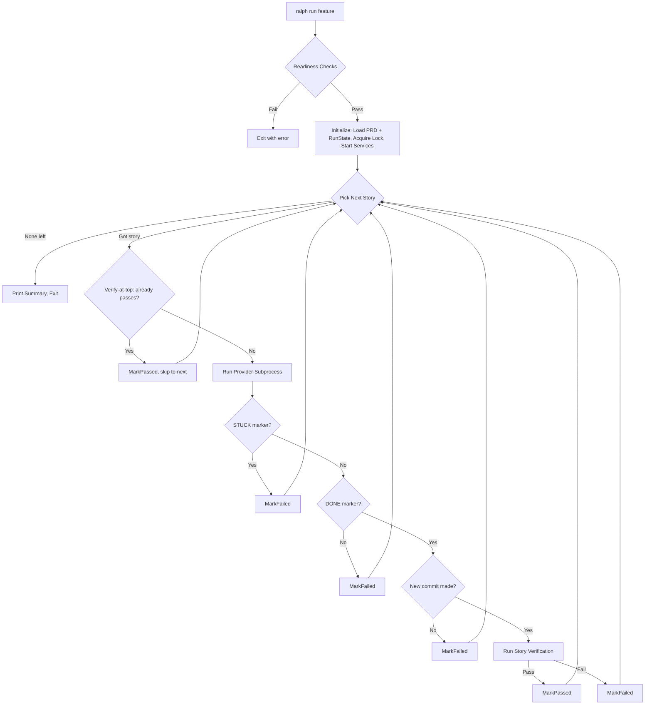
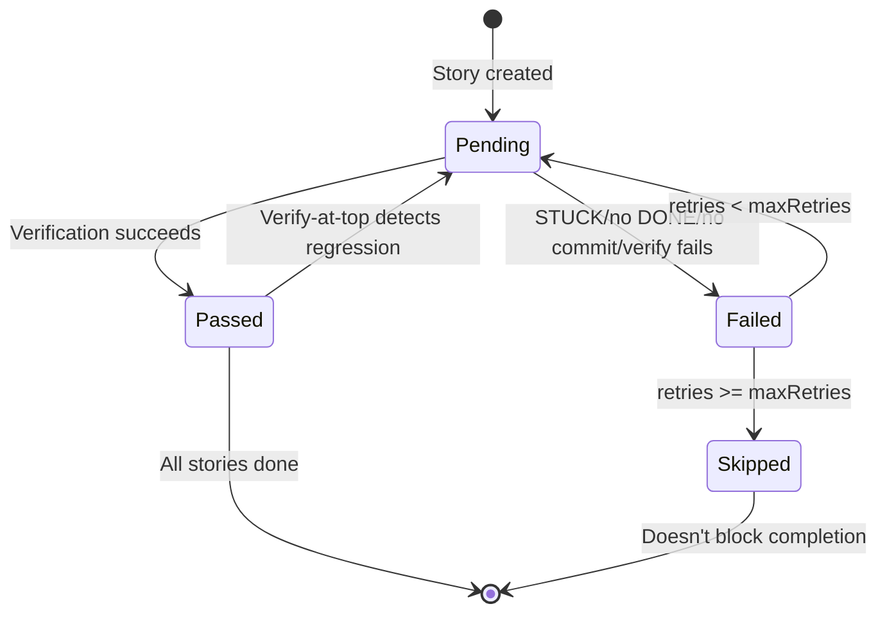

# Ralph v2

Autonomous AI agent loop for implementing PRD stories with any AI provider.

Ralph orchestrates AI coding agents (Amp, Claude Code, OpenCode, Aider, Codex) in an infinite loop until all PRD stories are complete and verified. Provider-agnostic design with deterministic verification.

> **Note**: This is Ralph v2, a complete Go rewrite of the original [snarktank/ralph](https://github.com/snarktank/ralph) bash-based loop. See [Background](#background) for the evolution from v1 to v2.

## Install

```bash
# One-line install (Linux/macOS)
curl -fsSL https://raw.githubusercontent.com/scripness/ralph/main/install.sh | bash

# Or with Go
go install github.com/scripness/ralph@latest
```

## Quick Start

```bash
# Initialize Ralph (detects project, prompts for provider + verify commands with auto-detected defaults)
ralph init

# Create a PRD for a feature
ralph prd auth

# Run the loop (runs forever until complete)
ralph run auth

# Check status anytime
ralph status auth
```

## The Ralph Pattern

The core idea: break work into small, atomic user stories, spawn fresh AI instances to implement them one at a time, verify each with automated tests, persist learnings for future iterations, and continue until all stories pass verification.

### Main Loop Flowchart



### Story State Machine



## How It Works

1. Ralph loads `.ralph/*-[feature]/prd.json` + `run-state.json`
2. **Readiness check**: refuses to run if `.ralph/` is missing, verify commands are placeholder, binaries missing from PATH, not inside a git repo, or `.ralph/` is not writable
3. Creates/switches to `ralph/{feature}` branch
4. Picks next story (highest priority, not passed, not skipped)
5. **Verify-at-top**: runs verification first — if story already passes, marks passed and skips implementation
6. Sends prompt to provider subprocess (includes deduplicated learnings)
7. Provider implements code, writes tests, commits
8. Provider outputs `<ralph>DONE</ralph>` when finished
9. Ralph runs `verify.default` commands
10. If UI story: restarts services, runs browser verification (console errors = hard fail), runs `verify.ui` commands
11. Service health check: verifies services still respond
12. Pass → mark story complete, next story
13. Fail → increment retries, retry or auto-skip at maxRetries
14. All stories passed or skipped → print summary, exit

## Commands

### Core Commands

```bash
ralph init [--force]           # Initialize Ralph (creates config + .ralph/)
ralph prd <feature>            # Create, refine, or manage a PRD
ralph run <feature>            # Run the agent loop (infinite until done)
ralph verify <feature>         # Run verification only
# Feature names are case-insensitive: "ralph run Auth" and "ralph run auth" find the same feature
```

### Status Commands

```bash
ralph status                   # Show all features
ralph status <feature>         # Show specific feature status
```

### Observability Commands

```bash
ralph logs <feature>                    # Latest run, last 50 events
ralph logs <feature> --list             # List all runs with summary
ralph logs <feature> --run 2            # Show run #2
ralph logs <feature> --follow           # Watch current run live (tail -f)
ralph logs <feature> --tail 100         # Show last 100 events (default: 50)
ralph logs <feature> --type error       # Filter by event type
ralph logs <feature> --story US-001     # Events for specific story
ralph logs <feature> --summary          # Quick summary of latest run
ralph logs <feature> --json             # Output raw JSONL for piping
```

### Utility Commands

```bash
ralph doctor                   # Check environment + readiness
ralph upgrade                  # Update to latest version
```

## Configuration

`ralph.config.json`:

```json
{
  "maxRetries": 3,
  "provider": {
    "command": "claude",
    "timeout": 1800
  },
  "services": [
    {
      "name": "dev",
      "start": "bun run dev",
      "ready": "http://localhost:3000",
      "readyTimeout": 30,
      "restartBeforeVerify": true
    }
  ],
  "verify": {
    "default": ["bun run typecheck", "bun run lint", "bun run test:unit"],
    "ui": ["bun run test:e2e"],
    "timeout": 300
  },
  "browser": {
    "enabled": true,
    "headless": true,
    "executablePath": "/usr/bin/chromium",
    "screenshotDir": ".ralph/screenshots"
  },
  "commits": {
    "prdChanges": true
  },
  "logging": {
    "enabled": true,
    "maxRuns": 10,
    "consoleTimestamps": true,
    "consoleDurations": true
  },
  "resources": {
    "enabled": true,
    "cacheDir": "~/.ralph/resources",
    "custom": []
  }
}
```

### Configuration Reference

| Section | Field | Type | Default | Description |
|---------|-------|------|---------|-------------|
| root | `maxRetries` | int | `3` | Max failed attempts per story before blocking |
| provider | `command` | string | **required** | AI CLI command (amp, claude, opencode, aider, codex) |
| provider | `args` | string[] | auto-detected | Arguments to pass to provider |
| provider | `timeout` | int | `1800` | Seconds per iteration (30 minutes) |
| provider | `promptMode` | string | auto-detected | How to pass prompt: `stdin`, `arg`, `file` |
| provider | `promptFlag` | string | auto-detected | Flag before prompt in arg/file modes |
| provider | `knowledgeFile` | string | auto-detected | Knowledge file: `AGENTS.md` or `CLAUDE.md` |
| services[] | `name` | string | **required** | Service identifier |
| services[] | `start` | string | - | Shell command to start service |
| services[] | `ready` | string | **required** | URL to poll for readiness |
| services[] | `readyTimeout` | int | `30` | Seconds to wait for ready |
| services[] | `restartBeforeVerify` | bool | `false` | Restart before each verification |
| verify | `default` | string[] | **required** | Commands for all stories (typecheck, lint, test) |
| verify | `ui` | string[] | `[]` | Commands for UI stories (e2e tests) |
| verify | `timeout` | int | `300` | Seconds per command (5 minutes) |
| browser | `enabled` | bool | `true` | Enable browser verification |
| browser | `headless` | bool | `true` | Run Chrome in headless mode |
| browser | `executablePath` | string | auto-detected | Path to Chrome/Chromium binary |
| browser | `screenshotDir` | string | `.ralph/screenshots` | Where to save screenshots |
| commits | `prdChanges` | bool | `true` | Auto-commit prd.json changes |
| logging | `enabled` | bool | `true` | Enable JSONL logging |
| logging | `maxRuns` | int | `10` | Max log files to keep per feature |
| logging | `consoleTimestamps` | bool | `true` | Show timestamps in console output |
| logging | `consoleDurations` | bool | `true` | Show durations in console output |
| resources | `enabled` | bool | `true` | Enable framework source caching |
| resources | `cacheDir` | string | `~/.ralph/resources` | Where to cache framework repos |
| resources | `custom` | Resource[] | `[]` | Custom framework mappings |

### Provider Auto-Detection

Only `command` is required. Everything else is auto-detected from the provider name:

| Provider | args | promptMode | promptFlag | knowledgeFile |
|----------|------|-----------|------------|---------------|
| `amp` | `--dangerously-allow-all` | stdin | - | AGENTS.md |
| `claude` | `--print --dangerously-skip-permissions` | stdin | - | CLAUDE.md |
| `opencode` | `run` | arg | - | AGENTS.md |
| `aider` | `--yes-always` | arg | `--message` | AGENTS.md |
| `codex` | `exec --full-auto` | arg | - | AGENTS.md |
| other | - | stdin | - | AGENTS.md |

Setting `"args": []` explicitly opts out of default args.

## PRD Schema (v3)

PRD data is split into two files: **prd.json** (definition) and **run-state.json** (execution state).

### prd.json (AI-authored, immutable during runs)

```json
{
  "schemaVersion": 3,
  "project": "ProjectName",
  "branchName": "ralph/feature-name",
  "description": "Feature description",
  "userStories": [{
    "id": "US-001",
    "title": "Story title",
    "description": "As a user, I want...",
    "acceptanceCriteria": ["Criterion 1", "Criterion 2"],
    "tags": ["ui"],
    "priority": 1,
    "browserSteps": [
      {"action": "navigate", "url": "/path"},
      {"action": "click", "selector": "#button"}
    ]
  }]
}
```

### run-state.json (CLI-managed execution state)

```json
{
  "passed": ["US-001", "US-003"],
  "skipped": ["US-005"],
  "retries": { "US-002": 2 },
  "lastFailure": { "US-002": "typecheck failed: ..." },
  "learnings": ["accumulated insights from providers"]
}
```

### Story Tags

| Tag | Effect |
|-----|--------|
| `ui` | Restarts services before verify, runs `verify.ui` commands, runs browser verification |

### Story Lifecycle

```
pending → provider implements → CLI verifies → passed (added to passed[])
                                             → retry (retries[id]++)
                                             → skipped (auto at maxRetries, added to skipped[])
```

## Provider Signal Protocol

Providers communicate with Ralph via markers in stdout or stderr:

| Signal | Purpose | Example |
|--------|---------|---------|
| `<ralph>DONE</ralph>` | Story implementation complete | `<ralph>DONE</ralph>` |
| `<ralph>STUCK:reason</ralph>` | Provider can't proceed (counts as failed, auto-skips at maxRetries) | `<ralph>STUCK:Cannot resolve type errors</ralph>` |
| `<ralph>LEARNING:text</ralph>` | Add learning for future context | `<ralph>LEARNING:Use bun instead of npm</ralph>` |

## Browser Automation

For UI stories, Ralph can run interactive browser verification like a real user. Define `browserSteps` in the story:

```json
{
  "id": "US-003",
  "title": "Login form works",
  "tags": ["ui"],
  "browserSteps": [
    {"action": "navigate", "url": "/login"},
    {"action": "type", "selector": "#email", "value": "test@example.com"},
    {"action": "type", "selector": "#password", "value": "secret"},
    {"action": "click", "selector": "button[type=submit]"},
    {"action": "waitFor", "selector": ".dashboard"},
    {"action": "assertText", "selector": "h1", "contains": "Welcome"}
  ]
}
```

### Browser Actions

| Action | Fields | Description |
|--------|--------|-------------|
| `navigate` | `url` | Go to URL (relative or absolute) |
| `click` | `selector` | Click an element |
| `type` | `selector`, `value` | Type text into input |
| `waitFor` | `selector` | Wait for element to be visible |
| `assertVisible` | `selector` | Assert element exists and is visible |
| `assertText` | `selector`, `contains` | Assert element contains text |
| `assertNotVisible` | `selector` | Assert element is hidden/not found |
| `submit` | `selector` | Click and wait for navigation |
| `screenshot` | - | Capture screenshot |
| `wait` | `timeout` | Wait N seconds |

All actions support optional `timeout` (seconds, default 10).

**Console errors are hard failures**: Any `console.error()` or uncaught exception during browser verification fails the story.

## Service Management

Ralph manages dev servers automatically:

1. **Start**: Spawns service process on `ralph run`
2. **Ready check**: Polls `ready` URL until response < 500
3. **Restart**: Optionally restarts before each verification (`restartBeforeVerify: true`)
4. **Health check**: Verifies services respond during verification
5. **Cleanup**: Kills all services on exit/error

Services capture stdout/stderr for diagnostics (available via logs).

## File Structure

```
project/
├── ralph.config.json              # Project configuration (required)
└── .ralph/
    ├── 2024-01-15-auth/
    │   ├── prd.md                 # Human-readable PRD
    │   ├── prd.json               # Story definitions (v3, no runtime state)
    │   ├── run-state.json         # Execution state (CLI-managed)
    │   └── logs/                  # Run history (JSONL)
    │       ├── run-001.jsonl
    │       └── run-002.jsonl
    ├── 2024-01-20-billing/
    │   ├── prd.md
    │   ├── prd.json
    │   └── logs/
    ├── screenshots/               # Browser verification evidence
    └── ralph.lock                 # Prevents concurrent runs
```

## Codebase Requirements for Maximum Success

Ralph works best with codebases that have:

### Required

- **Shell**: `sh` must be in PATH (used to execute verify and service commands)
- **Git repository**: Project must be inside a git repo with clean working tree
- **Type checking**: TypeScript strict mode, Go vet, mypy, etc.
- **Linting**: ESLint, golint, ruff, etc.
- **Test framework**: Unit tests at minimum (Jest, Go test, pytest)

### Recommended

- **E2E tests**: Playwright, Cypress, or similar for UI stories
- **Modular architecture**: Small, focused files that AI can understand
- **Clear interfaces**: Well-typed APIs and function signatures
- **Documentation**: README, API docs, or AGENTS.md/CLAUDE.md for AI context

### Supported Tech Stacks

Ralph auto-detects these via `ralph prd` discovery:

| Stack | Detection | Package Managers |
|-------|-----------|------------------|
| **Go** | `go.mod` | go |
| **TypeScript/JavaScript** | `package.json`, `tsconfig.json` | bun, npm, yarn, pnpm |
| **Python** | `pyproject.toml`, `requirements.txt`, `setup.py` | pip |
| **Rust** | `Cargo.toml` | cargo |
| **Elixir** | `mix.exs` | mix |

Frameworks detected: React, Next.js, Vue, Svelte, Express, FastAPI, Gin, Phoenix, etc.

## Framework Source Caching

Ralph automatically detects project dependencies and caches their source code repositories locally in `~/.ralph/resources/`. This enables AI agents to verify implementations against actual framework source code, tests, and examples.

### How It Works

1. **Detection**: When you run `ralph run`, Ralph extracts dependencies from package.json, go.mod, pyproject.toml, or Cargo.toml
2. **Mapping**: Dependencies are mapped to their source repositories (e.g., "next" → github.com/vercel/next.js)
3. **Caching**: Repos are cloned as shallow clones (`--depth 1`) to minimize disk usage
4. **Sync**: Before each run, repos are synced to latest if out of date
5. **Verification**: AI agents receive paths to cached source code for implementation verification

### Built-in Resources

~30 popular frameworks are mapped by default:

| Category | Frameworks |
|----------|------------|
| **Frontend** | React, Next.js, Vue, Nuxt, Svelte, SvelteKit, Angular |
| **Styling** | Tailwind CSS |
| **Backend** | Express, Fastify, Hono, Koa, Gin, Echo, Fiber, Chi |
| **ORM** | Prisma, Drizzle |
| **Testing** | Vitest, Jest, Playwright |
| **Validation** | Zod |
| **Build Tools** | Vite, esbuild, Webpack |
| **State** | Zustand, Jotai |

### Custom Resources

Add custom framework mappings in `ralph.config.json`:

```json
{
  "resources": {
    "custom": [
      {
        "name": "internal-ui",
        "url": "https://github.com/company/ui-library",
        "branch": "main",
        "notes": "Internal component library. Check src/components for patterns."
      }
    ]
  }
}
```

### Disk Usage

Typical shallow clones:
- Next.js: ~450MB
- React: ~280MB
- Smaller libs (Zod, Hono): ~10-30MB

Delete the `~/.ralph/resources/` directory to free space when needed.

## Use Cases

### Feature Implementation
```bash
ralph prd user-auth          # Create PRD for auth feature
ralph run user-auth          # AI implements login, signup, logout
```

### Bug Fixes
Create a PRD with a single story describing the bug and acceptance criteria for the fix.

### Refactoring
Break the refactor into atomic stories with clear verification:
- US-001: Extract database layer (tests pass)
- US-002: Add connection pooling (tests pass)
- US-003: Update all callers (tests pass)

### Continuing Work
```bash
ralph prd user-auth          # Select "Refine with AI" for interactive session
                              # Fix skipped stories, adjust scope, make changes
ralph run user-auth          # Verify-at-top catches already-done work, resumes loop
```

### UI Changes
Tag stories with `ui` and define `browserSteps` for visual verification.

## Idempotent Workflow

Ralph is designed for interruption:

```bash
ralph run auth          # Working on US-003...
^C                      # Stop (Ctrl+C)

# Later...
ralph run auth          # Resumes from US-003 automatically
```

State is preserved in run-state.json (separate from prd.json):
- `passed[]`: Completed story IDs
- `skipped[]`: Auto-skipped story IDs (exceeded maxRetries)
- `retries{}`: Failed attempt counts per story
- `learnings[]`: Accumulated insights from providers

On restart, verify-at-top-of-loop re-checks each story before spawning a provider.

## Troubleshooting

### "provider command not found"
```bash
ralph doctor            # Check if provider is in PATH
which amp               # Verify provider location
```

### "verify.default contains placeholder commands"
Edit `ralph.config.json` and replace echo commands with real verify commands:
```json
{
  "verify": {
    "default": ["bun run typecheck", "bun run lint", "bun run test"]
  }
}
```

### "PRD has UI stories but verify.ui has no commands"
Add e2e test commands to `ralph.config.json`:
```json
{
  "verify": {
    "ui": ["bun run test:e2e"]
  }
}
```

### "services[N].ready must be an HTTP URL"
Service ready URLs must include the protocol scheme:
```json
{
  "services": [{ "name": "dev", "ready": "http://localhost:3000" }]
}
```

### "Not inside a git repository"
```bash
git init                # Initialize a git repo in your project
```

### "Provider 'X' is not a known provider"
This is a non-blocking warning when using a custom provider command. Ralph will still work — provider defaults (promptMode, args, etc.) will use fallback values. You can set them explicitly in `ralph.config.json` if needed.

### "'sh' not found in PATH"
This shouldn't happen on standard Unix systems. Check your PATH configuration.

### "editor 'nano' not found in PATH"
```bash
export EDITOR=vim       # Set your preferred editor
```

### Story keeps failing verification
1. Check `ralph logs <feature> --type error` for specific failures
2. Review story notes: `ralph status <feature>`
3. Simplify acceptance criteria
4. Add more specific browser steps

### Browser verification fails
1. Check console errors in logs
2. Ensure `browser.executablePath` points to valid Chrome/Chromium
3. Try with `headless: false` to see what's happening
4. Verify selectors match actual DOM

### Lock file prevents running
```bash
ralph doctor            # Shows lock status
rm .ralph/ralph.lock    # Remove stale lock (if safe)
```

## Updating

Ralph checks for updates in the background and notifies you when a new version is available:

```
A new version of ralph is available: v2.1.0 (current: v2.0.0)
Run 'ralph upgrade' to update.
```

To update:
```bash
ralph upgrade
```

## Build from Source

```bash
git clone https://github.com/scripness/ralph
cd ralph
make build
```

## Testing

```bash
make test               # Run all tests
go test -v ./...        # Verbose output
go test -cover ./...    # With coverage
```

## Releasing

Releases are automated via [GoReleaser](https://goreleaser.com/) and GitHub Actions.

```bash
# Patch release from local (requires gh CLI)
make release

# Or from GitHub UI: Actions → Release → Run workflow → pick bump type
```

The workflow auto-bumps the version tag, runs tests, builds 4 binaries (linux/darwin x amd64/arm64), and creates a GitHub Release.

## Background

Ralph v2 is a complete rewrite of the original [snarktank/ralph](https://github.com/snarktank/ralph) (the "Ralph pattern" by Geoffrey Huntley).

### Original Ralph (v1)

The original Ralph was a bash script (`ralph.sh`) that:
- Spawned fresh AI instances (Amp or Claude Code) in a loop
- Used `prompt.md` / `CLAUDE.md` for agent instructions
- Stored memory in `progress.txt` (append-only log)
- Relied on the agent to manage story state in `prd.json`
- Had fixed iteration limits (default 10)
- Required provider-specific skills (dev-browser, etc.)

### Ralph v2 (this repo)

v2 is a Go CLI that improves on v1:

| Aspect | v1 (bash) | v2 (Go CLI) |
|--------|-----------|-------------|
| **Architecture** | Bash script | Compiled Go binary |
| **Provider support** | Amp or Claude only | Any AI CLI (provider-agnostic) |
| **Story selection** | Agent decides | CLI decides (deterministic) |
| **State management** | Agent updates prd.json | CLI manages all state |
| **Memory** | progress.txt file | Learnings in run-state.json |
| **Iteration limit** | Fixed (default 10) | Infinite until verified |
| **Multi-feature** | Manual archive/switch | Built-in date-prefixed dirs |
| **Crash recovery** | None | Verify-at-top-of-loop re-checks on restart |
| **Verification** | Agent runs commands | CLI runs commands |
| **Browser testing** | Provider skill (dev-browser) | Built-in rod (auto-downloads Chromium) |
| **Service management** | None | Built-in start/ready/restart |
| **Concurrency** | None | Lock file prevents conflicts |

For more on the pattern, see [ghuntley.com/ralph/](https://ghuntley.com/ralph/).

## License

MIT
